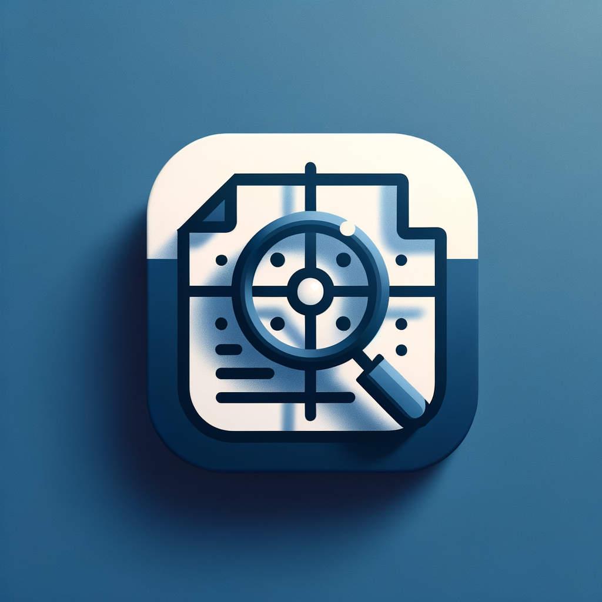

<div align="center">
  
  
  # Clarity - ArXiv iOS Client
  
  **A modern, elegant iOS client for browsing ArXiv papers**
  
  [](https://swift.org)
  [](https://developer.apple.com/ios/)
  [](https://tuist.io)
  [](LICENSE)
</div>

## 📱 Screenshots

<div align="center">
  
  
</div>

*Clarity automatically loads interesting papers on startup and provides detailed paper views with download and browser reading options.*

## ✨ Features

### 🎯 **Smart Discovery**
- **Interesting Papers**: Automatically loads engaging papers on startup with diverse topics
- **Curated Content**: Rotating search terms for quantum computing, AI consciousness, neural creativity, and more
- **Fresh Content**: Pull-to-refresh for new discoveries

### 🔍 **Powerful Search**
- **Real-time Search**: Search across titles, abstracts, authors, and categories
- **Category Filtering**: Filter by specific ArXiv categories (AI, ML, Computer Vision, etc.)
- **Smart Results**: Relevance-based sorting with recent papers prioritized

### 📄 **Detailed Paper Views**
- **Comprehensive Information**: View full paper details including title, authors, abstract, and categories
- **PDF Download**: Download papers directly to your device for offline reading
- **Browser Reading**: Open papers in Safari for online reading with full ArXiv functionality
- **Easy Sharing**: Copy ArXiv URLs to share papers with colleagues
- **Publication Info**: See publication and update dates with ArXiv ID for reference

### 🎨 **Modern Design**
- **SwiftUI Native**: Built entirely with SwiftUI for smooth, native performance
- **Clean Interface**: Minimalist design focused on readability
- **Responsive Layout**: Optimized for all iPhone sizes
- **Dark Mode**: Full dark mode support

### 🏗️ **Architecture**
- **Post-MVVM**: Modern architecture using SwiftUI's @Observable, inspired by [Thomas Ricouard's approach](https://dimillian.medium.com/swiftui-in-2025-forget-mvvm-262ff2bbd2ed)
- **Modular Design**: Separated business logic in ArxivKit framework
- **Dependency Injection**: Environment-based service injection
- **Error Handling**: Comprehensive error states with retry functionality

## 📖 How to Use

### Browsing Papers
1. **Launch the app** - Clarity automatically loads interesting papers from various categories
2. **Browse the list** - Scroll through the curated selection of recent papers
3. **Tap any paper** - Navigate to the detailed view for comprehensive information

### Paper Detail View
- **Read the full abstract** - Get complete paper summaries with proper formatting
- **View author information** - See all authors and publication details
- **Check categories** - Understand the paper's subject classifications
- **Download PDF** - Save papers locally for offline reading
- **Read in browser** - Open the full ArXiv page in Safari
- **Copy URL** - Share paper links easily

### Search & Discovery
- **Use the search bar** - Find papers by title, author, or keywords
- **Pull to refresh** - Get the latest papers and discoveries

## 🚀 Getting Started

### Prerequisites

- **Xcode 15.0+**
- **iOS 17.0+**
- **Tuist 4.44+**
- **Swift 5.9+**

### Installation

1. **Clone the repository**
   ```bash
   git clone https://github.com/pedrocid/arxiv-clarity-ios.git
   cd arxiv-clarity-ios
   ```

2. **Install Tuist** (if not already installed)
   ```bash
   curl -Ls https://install.tuist.io | bash
   ```

3. **Install dependencies**
   ```bash
   tuist install
   ```

4. **Generate the Xcode project**
   ```bash
   tuist generate
   ```

5. **Open in Xcode**
   ```bash
   open Clarity.xcworkspace
   ```

6. **Build and run**
   - Select your target device/simulator
   - Press `Cmd+R` to build and run

## 🏛️ Architecture

### Project Structure
```
arxiv-clarity-ios/
├── Clarity/                    # Main iOS App Target
│   ├── Sources/
│   │   ├── ClarityApp.swift     # App entry point
│   │   ├── PaperListView.swift  # Main paper list
│   │   ├── PaperRowView.swift   # Individual paper row
│   │   └── PaperDetailView.swift # Detailed paper view
│   └── Resources/               # App resources
├── ArxivKit/                  # Business Logic Framework
│   ├── Sources/
│   │   ├── ArxivService.swift # API service layer
│   │   └── AppState.swift     # Observable app state
│   └── Tests/                 # Unit tests
├── Tuist/                     # Tuist configuration
│   ├── Package.swift         # Dependencies
│   └── Config.swift          # Project config
└── Project.swift              # Main project definition
```

### Key Components

#### 🔧 **ArxivService**
- Handles all ArXiv API interactions
- Provides methods for fetching latest papers, searching, and discovering interesting content
- Built on top of ArxivSwift library

#### 📊 **AppState**
- Observable state management using SwiftUI's @Observable
- Manages papers array, loading states, search text, and selected categories
- Provides helper methods for state updates

#### 🎨 **Views**
- **PaperListView**: Main interface with search, filtering, and paper list with navigation to detail views
- **PaperRowView**: Individual paper display with title, authors, and category badge
- **PaperDetailView**: Comprehensive paper details with download, browser reading, and sharing options

## 🔧 Technical Details

### Modern SwiftUI Architecture

Clarity follows a **post-MVVM architecture** as advocated by [Thomas Ricouard](https://dimillian.medium.com/swiftui-in-2025-forget-mvvm-262ff2bbd2ed), leveraging SwiftUI's native capabilities:

- **@Observable State Management**: Using Swift's modern `@Observable` macro instead of traditional ViewModels
- **Direct Data Flow**: Views directly observe and interact with business logic services
- **Simplified Architecture**: No unnecessary abstraction layers between views and data
- **SwiftUI-First Design**: Built specifically for SwiftUI's declarative paradigm

This approach eliminates the complexity of MVVM while maintaining clean separation of concerns and testability.

### Dependencies
- **[ArxivSwift](https://github.com/pedrocid/ArxivSwift)**: Swift library for ArXiv API integration
- **SwiftUI**: Native iOS UI framework
- **Foundation**: Core Swift functionality

### Network Configuration
The app includes App Transport Security exceptions for the ArXiv API:
```xml
<key>NSAppTransportSecurity</key>
<dict>
    <key>NSExceptionDomains</key>
    <dict>
        <key>export.arxiv.org</key>
        <dict>
            <key>NSExceptionAllowsInsecureHTTPLoads</key>
            <true/>
            <key>NSExceptionMinimumTLSVersion</key>
            <string>TLSv1.2</string>
        </dict>
    </dict>
</dict>
```

### Available Categories
- **cs.AI**: Artificial Intelligence
- **cs.LG**: Machine Learning  
- **cs.CV**: Computer Vision
- **cs.CL**: Computation and Language
- **cs.CR**: Cryptography and Security
- **physics.gen-ph**: General Physics
- **math.CO**: Combinatorics
- **q-bio.QM**: Quantitative Methods
- **stat.ML**: Machine Learning (Statistics)

## 🧪 Testing

Run tests using Tuist:
```bash
tuist test
```

Or through Xcode:
- Press `Cmd+U` to run all tests
- Tests are organized in `ClarityTests` and `ArxivKitTests` targets

## 🚀 Building & Deployment

### Development Build
```bash
tuist build
```

### Release Build
```bash
tuist build --configuration Release
```

### Running on Simulator
```bash
tuist build --platform iOS-simulator
# App will be available in derived data
```

## 🤝 Contributing

1. Fork the repository
2. Create a feature branch (`git checkout -b feature/amazing-feature`)
3. Commit your changes (`git commit -m 'Add amazing feature'`)
4. Push to the branch (`git push origin feature/amazing-feature`)
5. Open a Pull Request

## 📝 License

This project is licensed under the MIT License - see the [LICENSE](LICENSE) file for details.

## 🙏 Acknowledgments

- **ArXiv**: For providing free access to scientific papers
- **Tuist**: For excellent project generation and dependency management
- **SwiftUI**: For making iOS development more enjoyable

## 📞 Contact

Pedro Cid - [@pedrocid](https://github.com/pedrocid)

Project Link: [https://github.com/pedrocid/arxiv-clarity-ios](https://github.com/pedrocid/arxiv-clarity-ios)

---

<div align="center">
  Made with ❤️ and SwiftUI
</div> 